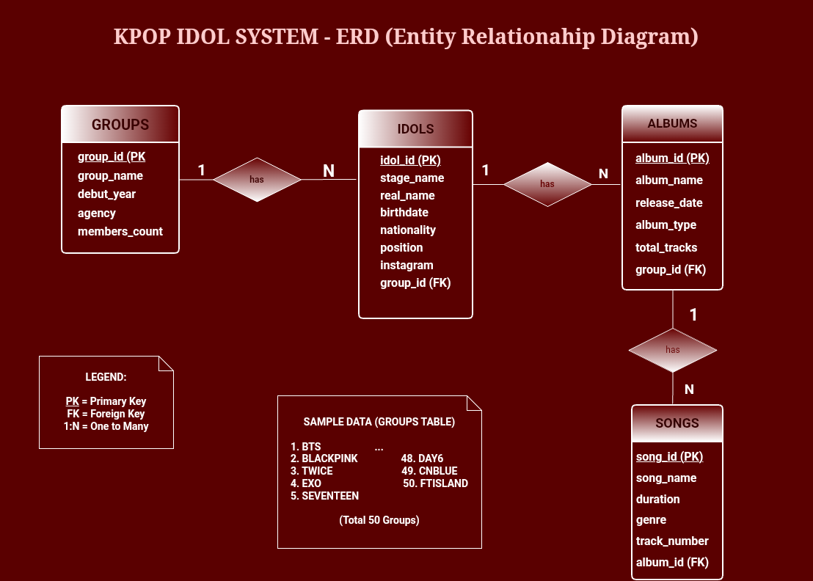
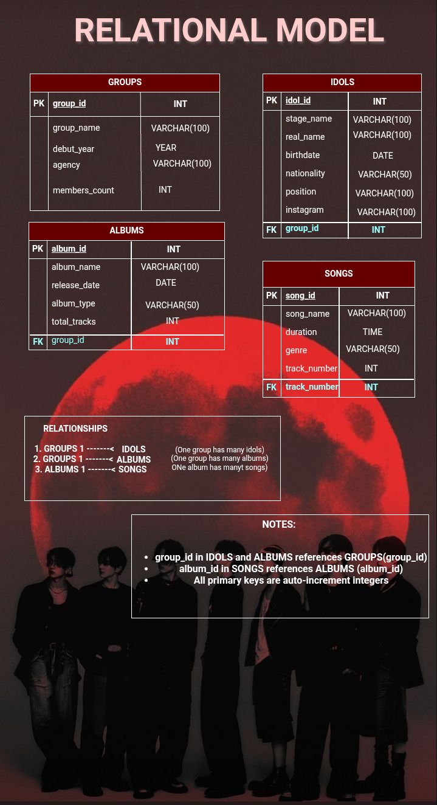

# KPOP Idol SCRUD System

A Flask and MySQL-based web application for managing K-pop groups, idols, albums, and songs.

---

# a. Introduction

## Background

The global popularity of K-pop has significantly increased the amount of information related to K-pop groups, idols, albums, and songs. Managing this information manually using spreadsheets or paper records can become inefficient, unorganized, and difficult to maintain. This project was developed to provide a centralized and user-friendly web application that allows users to manage K-pop-related data efficiently using database technologies.

---

## Problem Statement

Many users experience difficulties organizing large amounts of K-pop data manually. Traditional methods often result in duplicate entries, inefficient searching, inconsistent updates, and poor data management. This application aims to solve these issues by providing a searchable SCRUD (Search, Create, Read, Update, Delete) system integrated with a MySQL database.

---

## Scope

The project focuses on managing four primary categories:

- K-pop Groups
- K-pop Idols
- K-pop Albums
- K-pop Songs

The system includes:
- User authentication
- Search functionality
- CRUD operations
- Responsive user interface
- Database connectivity

The system does not include:
- Online user registration
- Cloud database hosting
- API integration
- Music streaming services
- Mobile application support

---

## Target Users

The application is intended for:

- K-pop fans
- Database management students
- Administrators managing K-pop information
- Users who want organized digital records of K-pop content

The system benefits users by providing fast searching, organized records, and efficient management of K-pop data.

---

# b. Project Objectives

## Primary Objective

To develop a Flask and MySQL-based SCRUD application that efficiently manages K-pop groups, idols, albums, and songs using a web-based interface.

---

## Secondary Objectives

- To establish database connectivity using Flask-MySQLdb
- To create a responsive and user-friendly interface using Bootstrap
- To implement complete SCRUD functionalities
- To provide live search functionality
- To manage user sessions and authentication
- To organize records using relational database concepts

---

# c. Business Rules

## Detailed Business Logic

### User Authentication
- Users must log in before accessing the system
- Sessions are required to maintain user authentication
- Unauthorized users are redirected to the login page

### Database Connection
- The application connects to a MySQL database named `cccs105`
- Flask-MySQLdb is used for database communication

### CRUD Operation Constraints
- Records can only be edited or deleted if they exist
- Each table uses a primary key for identification
- Changes are committed directly to the database

### Data Validation Rules
- Input fields cannot be left empty
- Search inputs are case-insensitive
- Required fields must contain valid values

### Access Control
- Only authenticated users can perform CRUD operations
- Guests cannot access protected routes

---

## Constraints

### Technical Constraints
- Requires Python installation
- Requires MySQL/XAMPP server
- Requires internet connection for Bootstrap CDN
- Limited to local hosting environment

### Operational Constraints
- Single-admin login system only
- No multi-user support
- No cloud deployment

---

## Conditions

- Users must log in successfully before accessing the system
- MySQL server must be running
- Session data must remain active during usage
- Database tables must already exist

---

# d. Database Models

## Entity Relationship Diagram (ERD)



### Entities and Relationships

The database contains the following entities:

- Groups
- Idols
- Albums
- Songs

Relationships:
- One group can have many idols
- Albums and songs are stored independently
- Each entity contains its own primary key

---

## Relational Model



### Tables and Attributes

#### groups
- group_id
- group_name
- debut_year
- company

#### idols
- idol_id
- stage_name
- real_name
- birthdate
- nationality
- position
- instagram
- group_id

#### albums
- album_id
- album_name
- release_date
- album_type

#### songs
- song_id
- title
- duration
- genre

---

# e. Project Overview

The application follows a simple MVC-inspired structure:

- Model → MySQL Database
- View → HTML Templates
- Controller → Flask Routes

---

## Key Components

### Flask Backend
Handles routing, database queries, session management, and business logic.

### MySQL Database
Stores all K-pop-related information.

### Bootstrap Frontend
Provides responsive and colorful user interface design.

### JavaScript Search
Handles live table searching and highlighting.

---

# f. Setup Instructions

## Prerequisites

Install the following:

- Python 3.x
- XAMPP/MySQL
- Git
- VS Code (optional)

---

## Installation Steps

### 1. Clone Repository

```bash
git clone https://github.com/YOUR_USERNAME/kpop-idol-system.git
```

---

### 2. Open Project Folder

```bash
cd kpop-idol-system
```

---

### 3. Create Virtual Environment

```bash
python -m venv venv
```

---

### 4. Activate Virtual Environment

#### Windows

```bash
venv\Scripts\activate
```

#### Mac/Linux

```bash
source venv/bin/activate
```

---

### 5. Install Dependencies

```bash
pip install -r requirements.txt
```

---

### 6. Configure Database

Create a MySQL database named:

```text
cccs105
```

Import your SQL file into phpMyAdmin.

---

### 7. Run Application

```bash
python app.py
```

---

### 8. Access Application

Open browser:

```text
http://127.0.0.1:5000
```

---

# g. Team Members & Roles

| Name | Role | Responsibilities |
|---|---|---|
| CHP | Full Stack Developer | Backend, frontend, database integration, UI design |

---

# h. Dependencies

## Python Packages

| Package | Version |
|---|---|
| Flask | Latest |
| flask-mysqldb | Latest |
| mysqlclient | Latest |

---

## System Requirements

| Component | Requirement |
|---|---|
| Operating System | Windows 10/11 |
| Python | 3.x |
| MySQL | 5.x or higher |
| Browser | Chrome, Edge, Firefox |
| RAM | 4GB minimum |

---

# i. Running Instructions

## Start Application

```bash
python app.py
```

---

## Stop Application

Press:

```text
CTRL + C
```

inside the terminal.

---

## Default Login Credentials

### Username

```text
admin
```

### Password

```text
1234
```

---

## Navigation Guide

### Home Page
Displays dashboard cards for all modules.

### Groups Module
Manage K-pop group information.

### Idols Module
Add, edit, delete, and search idol records.

### Albums Module
Manage album information.

### Songs Module
Manage song records and perform live searches.

---

# Author

Developed by CHP
